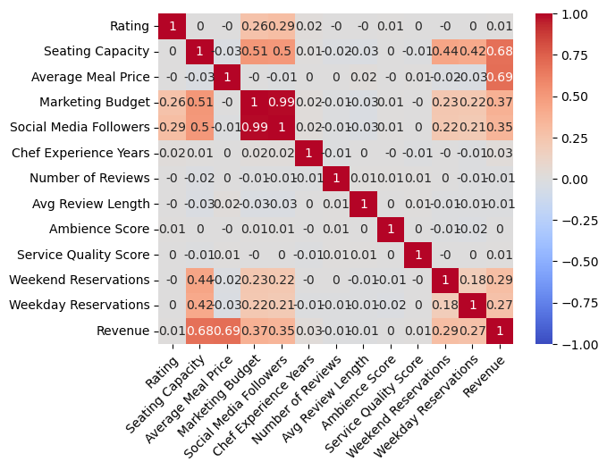
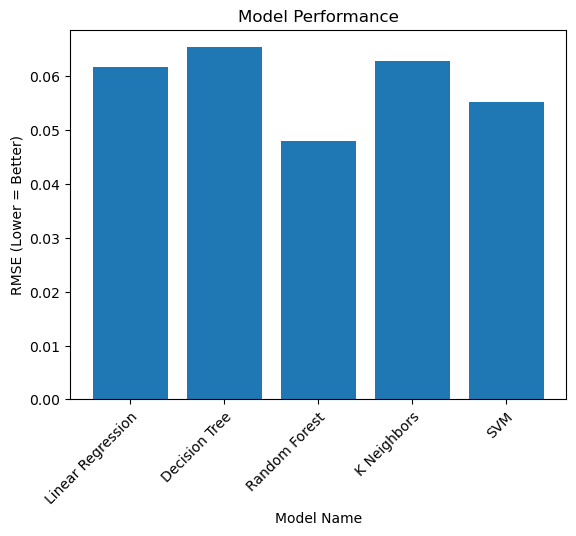
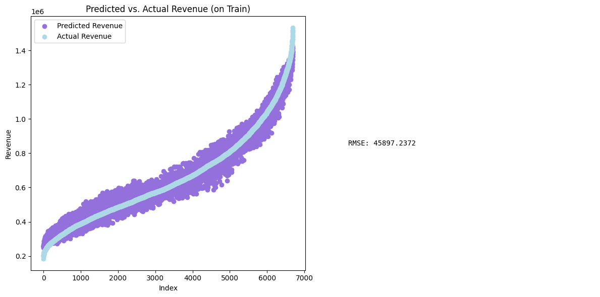
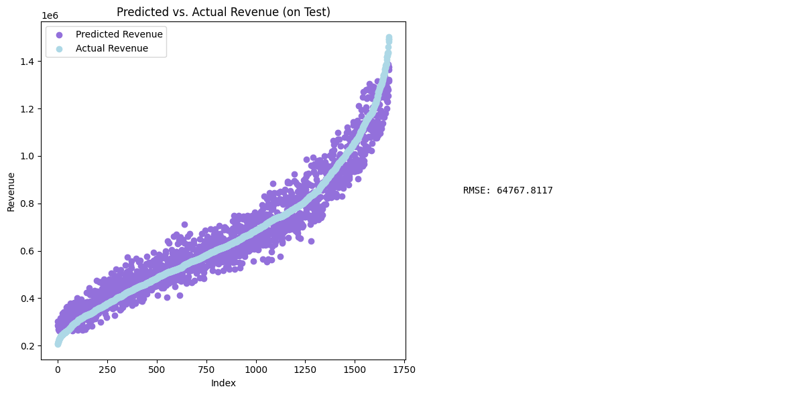

# CSE-151A-Restaurant-Revenue    🍽☕️🍻

For the most accurate version of our findings, please see the PDF version here. <a target="_blank" href="https://github.com/Viridian01/CSE-151A-Restaurant-Revenue/blob/8c05b95b5ab2befe95c37c99334125ab8a08de2a/assets/CSE_151A___Restaurant_Revenue.pdf">
   
</a>

## Milestone 2
Gateway to Milestone 2:
<a target="_blank" href="https://github.com/Viridian01/CSE-151A-Restaurant-Revenue/tree/milestone2">
  
</a>

## Milestone 3
Gateway to Milestone 3:
<a target="_blank" href="https://github.com/Viridian01/CSE-151A-Restaurant-Revenue/tree/milestone3">
  
</a>


## Jupyter Notebook
Gateway to the Jupyter Notebook:
<a target="_blank" href="https://colab.research.google.com/github/Viridian01/CSE-151A-Restaurant-Revenue/blob/milestone4/main.ipynb">
  
</a>

## Environment setup instructions:
1. Link to download data from [Kaggle](https://www.kaggle.com/datasets/anthonytherrien/restaurant-revenue-prediction-dataset) or [here](data/restaurant_data.csv)
2. Unzip the file and upload it into the Google Colab
3. Imports needed for data processing

   ```
   import numpy as np
   import pandas as pd
   import matplotlib.pyplot as plt
   import seaborn as sns
   ```
---

## Introduction
Do you ever wonder why some restaurants are more successful than others? Could it be the type of cuisine, consumer preferences, or menu prices? We hope to answer this question by developing a model that aims to predict our measure of success, and total revenue, utilizing many attributes about a restaurant. We chose this area of focus for a variety of reasons. First, the idea of predicting the success of an institution in the food sector immediately appeals to us as both a topic not heavily explored, as well as one that can personally affect us as consumers. Many of the applications of predictive machine learning models are in large companies and institutions, but restaurants can be locally owned, even by the people close to us. Furthermore, our dataset is clean and contains a large enough sample size with enough features, which are both vital aspects for training a performant model. Through this project, we hope not only to better understand the financial aspects of food but also to create a useful tool for small business owners to fine-tune their restaurants to maximize their revenue.

## Methods
### Data Exploration
We first introduce our dataset, with examples shown in [Table 1](#preprocessing). The full dataset can be found at this [URL](https://colab.research.google.com/github/Viridian01/CSE-151A-Restaurant-Revenue/blob/milestone4/main.ipynb). Our dataset has 8368 observations and 17 features (including the target, and revenue). The features are as follows:

   - `Name` — serves as an identifier for each restaurant.
   - `Location` — gives the location category of the restaurant, either rural, downtown, or suburban.
   - `Cuisine` — gives the type of cuisine the restaurant serves, either Japanese, Mexican, Italian, Indian, French, or American.
   - `Rating` — gives the average rating of the restaurant on a five-star scale.
   - `Seating Capacity` — gives the total number of seats in the restaurant.
   - `Average Meal Price` — gives the average price of a meal at the restaurant (in an unknown currency--we assume USD).
   - `Marketing Budget` — gives the budget allocated towards marketing by the restaurant (in an unknown unit--we assume USD per month).
   - `Social Media Followers` — gives the total number of followers on the restaurant's social media.
   - `Chef Experience Years` — gives the number of years of experience of the head chef.
   - `Number of Reviews` — gives the total number of reviews the restaurant has received.
   - `Avg Review Length` — gives the average length of a review (in an unknown unit--we assume words).
   - `Ambience Score` — gives the score of the restaurant's ambience on a 10-point scale.
   - `Service Quality Score` — gives the score of the restaurant's service on a 10-point scale.
   - `Parking Availability` — denotes whether parking is available at the restaurant or not.
   - `Weekend Reservations` — gives the number of total weekend reservations in an average week.
   - `Weekday Reservations` — gives the number of total weekday reservations in an average week.
   - `Revenue` — gives the total revenue generated by the restaurant (in an unknown unit--we assume USD per year).

Note that we make some assumptions about our dataset's features, the motivation for which is detailed in our notebook. Our notebook also details some further data exploration steps: however, crucial findings are later discussed.

<div align="center">
	
  <p><em>Heatmap</em></p>
</div>

<div align="center">
	
  <p><em>Pairplot</em></p>
</div>

| Name                      | Restaurant 0 | Restaurant 1 | Restaurant 2 |
|---------------------------|--------------|--------------|--------------|
| Location                  | Rural        | Downtown     | Rural        |
| Cuisine                   | Japanese     | Mexican      | Italian      |
| Rating                    | 4.0          | 3.2          | 4.7          |
| Seating Capacity          | 38           | 76           | 48           |
| Average Meal Price        | 73.98        | 28.11        | 48.29        |
| Marketing Budget          | 2224         | 4416         | 2796         |
| Social Media Followers    | 23406        | 42741        | 37285        |
| Chef Experience Years     | 13           | 8            | 18           |
| Number of Reviews         | 185          | 533          | 853          |
| Avg Review Length         | 161.92       | 148.76       | 56.85        |
| Ambience Score            | 1.3          | 2.6          | 5.3          |
| Service Quality Score     | 7.0          | 3.4          | 6.7          |
| Parking Availability      | Yes          | Yes          | No           |
| Weekend Reservations      | 13           | 48           | 27           |
| Weekday Reservations      | 4            | 6            | 14           |
| Revenue                   | 638945       | 490208       | 541369       |

_Table 1: The table shows the first 3 examples in the dataset, along with all of their features._

### Preprocessing
Our dataset is already quite clean, so little preprocessing is required. Notably, our dataset contains no missing data, so imputation is not required. Our only preprocessing steps are the following:
   1. We encode the categorical features. For `Cuisine` and `Location`, we used One-Hot encoding. For `Parking Availability`, we simply encode it as 0 and 1, as the feature is a boolean value.
   2. We scale the data, using min-max normalization. Our data exploration shows that many of the features are not normally distributed, so this kind of scaling is more logical than standardization.

Our data exploration also shows that many features are already very linearly correlated with `Revenue`, so we do not feel the need to expand our feature set any further. Finally, we split our dataset into a training and testing subset.
 
### Model Selection
To select a model, we compare a variety of regression models using cross-validation on our training set. The models chosen are simple linear regression, k-nearest neighbors (KNN), a decision tree, a random forest regressor, a support vector regressor (SVR), and a multilayer perceptron (MLP). After determining which model yields the best evaluation metric, for which we use root mean squared error (RMSE), we perform further hyperparameter tuning to determine whether our model can be improved further. The results of our model selection process are discussed in the next section.

## Results
The cross-validation results of our initial models (excluding the MLP) are shown in Figure `Model Performance Histogram`. Note that the RMSE here is scaled and not an interpretable value relative to the true revenue values.

<div align="center">
	
  <p><em>Model Performance Histogram</em></p>
</div>

We tune hyperparameters only for the random forest model and the MLP. Performing a grid search over two hyperparameters for the random forest yields the results shown in Figure `Random Forest Performance with Hyperparameter Tuning`.

<div align="center">
	
  <p><em>Random Forest Performance with Hyperparameter Tuning</em></p>
</div>

Additionally, we tune the number of units within each layer (excluding the output layer) for the MLP to further optimize the model. After doing so, the best architecture we obtained was a fully connected 5-layer network. It includes an input layer, three hidden layers with ReLU activation functions containing 176, 16, 56, and 48 nodes respectively, and a sigmoid output layer.

Finally, after tuning both model candidates, the random forest achieves about 45897 RMSE on the training set and \$64767 on the testing set, while the MLP achieves \$45410 RMSE on the training set and \$71401 on the testing set. For reference, the mean revenue across the dataset is about \$656000. The fitting results for RandomForest are shown in Figure `RandomForest Training Set` and `RandomForest Testing Set`, which displays both the true and predicted values for both models, as well as the RMSE.

<div align="center">
	
  <p><em>RandomForest Training Set</em></p>
</div>

<div align="center">
	
  <p><em>RandomForest Testing Set</em></p>
</div>

The fitting results for the hyperparameter-tuned MLP shown in Figure `Tuned MLP Training Set` and `Tuned MLP Testing Set`, display both the true and predicted values for both models, as well as the RMSE.

<div align="center">
	
  <p><em>Tuned MLP Training Set</em></p>
</div>

<div align="center">
	
  <p><em>Tuned MLP Testing Set</em></p>
</div>

Since our random forest model performs the best, we finally look into the feature importances for the model's predictions, as seen in Figure 7. The features with the highest importance were the average meal price, seating capacity, and marketing budget. This suggests that these factors play a significant role in determining a restaurant's revenue, aligning with intuitive expectations about the impact of pricing, capacity, and marketing efforts on financial performance.

<div align="center">
	
  <p><em>Feature Importancet</em></p>
</div>


## Discussion
### Model Selection and Evaluation
Our model selection process was relatively straightforward due to the strong linear correlations between many of the features and the target variable, revenue. This linearity allowed even simpler models to perform reasonably well without extensive tuning. The Random Forest model stood out, achieving an RMSE of \$45897 on the training set and \$64767 on the testing set. The slight overfitting observed suggests that while the model captures patterns well, it also picks up noise in the training data. The MLP model, with an RMSE of \$45410 on the training set and \$71401 on the testing set, performed slightly worse but validated the robustness of our feature set. Due to the Random Forest model performing better than our hyperparameter-tuned MLP, we decided to choose Random Forest as our final model to evaluate and conclude our results on.\\

Observing the most important features in Figure 7, we see that overall, the features with the highest importance are the average meal price, seating capacity, and marketing budget. This suggests that these factors play a significant role in determining a restaurant's revenue, aligning with intuitive expectations about the impact of pricing, capacity, and marketing efforts on financial performance. However, it is surprising to see just how much average meal price leads by, as we expect other features to be somewhat close in terms of importance. Still, there may be more hidden features and factors that can contribute to the revenue and success of a restaurant. Another relevant set of data for our feature importances is simply the linear correlations of features, shown in Figure 8. Again, we see that average meal price and seating capacity are the most highly linearly correlated with revenue. Thus, one may be tempted to assume that increasing both of these factors can increase revenue; however, this ignores many other factors that can be associated with these two features. For example, a restaurant that charges more for meals will generally be a higher-end restaurant, which can affect the kind of customer attending. However, for a lower-end restaurant, it may not make sense to directly increase prices to hope for revenue increase.

### Data Assumptions and Limitations
We made several assumptions regarding the dataset, such as assuming all currency values were in USD and interpreting various features like marketing budget and reservations on a monthly and weekly basis, respectively. These assumptions could introduce inaccuracies if the actual units differ. The dataset's unusually clean and consistent nature raises the possibility that it might be synthetic, which would limit the relevancy of our models to real-world scenarios.

### Shortcomings
A major shortcoming is the dataset's lack of diversity, containing only higher-end restaurants with average meal prices above \$25 and excluding many common cuisines. This limits our model's applicability to a broader range of restaurants. Additionally, hyperparameter tuning yielded minimal improvements, suggesting that our initial models were already near-optimal or that our search space was insufficiently extensive.

## Conclusion
Over the course of pre-processing the data, building these models, and interpreting the results, we have made many findings to hopefully increase restaurant revenue. However, we believe they may be unrealistic. Despite the dataset not being labeled as so, we suspect our restaurant dataset is synthetic due to the high consistency and sterility of the data. If so, our models cannot be generalized to real restaurants as their distribution may be completely different from this dataset. However, given a real dataset of collected restaurants, one could likely train similar models and obtain similar—though less performant—results. Even if the dataset is not artificial, it does not fully represent the distribution of all restaurants. For example, it only contains higher-end restaurants, with an average meal price above \$25. Additionally, it does not contain any examples for many common cuisines, so we cannot be sure whether our models would perform well on restaurants not captured by the dataset's distribution.

Thus, future work would most likely entail finding a stronger dataset that more accurately represents the true distribution of desired restaurants and then performing a similar model selection process to our own. A more representative dataset would include a wider range of restaurant types, price points, and cuisines, ensuring that the models developed could generalize to a broader spectrum of real-world scenarios. Additionally, this dataset would likely require more comprehensive preprocessing steps, as real-world data is often messier and more variable. Addressing these challenges would involve implementing more sophisticated data-cleaning techniques, such as handling missing values and dealing with outliers. Further, exploring advanced feature engineering methods could uncover additional predictive features, potentially improving model performance. Overall, these steps would enhance the robustness and applicability of the models, providing more reliable insights into factors driving restaurant revenue.

---

## Statement of Collaboration
- Brandon Park
  	- **Contribution**: Performed all data exploration, model selection, evaluation, and tuning. Heavily refactored all code and revised the final report.
- Jeremy Lin
	- **Contribution**: Performed data preprocessing, including One-Hot encoding and Min-Max Normalization. Revise the final report, and write the README.
- Nicholas Nakano
	- **Contribution**: Built initial linear and polynomial regression models. Performed hyper-parameter tuning on MLP to optimize the number of units per layer. Revised parts of the report.
- Purich Viwatkurkul
	- **Contribution**: Helped with dataset allocation, Implemented MLP (Multilayer Perceptron) and K-Crossfold Validation, wrote the introduction, methods, and conclusion in the written report, revised README, wrote annotated comments, and revised evaluations throughout the notebook and report.
- Shrieyaa Sekar Jayanthi
	- **Contribution**: Implemented log transformation for preprocessing, conducted feature importance analysis, revised README, and authored results, discussion, and conclusion in the final report.
